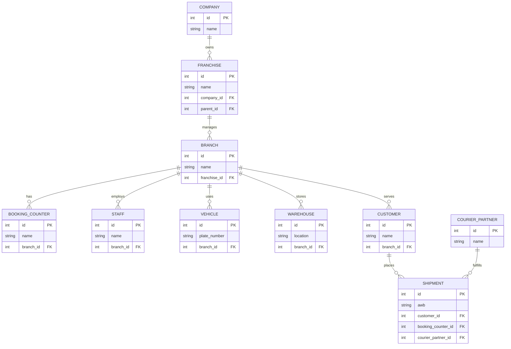
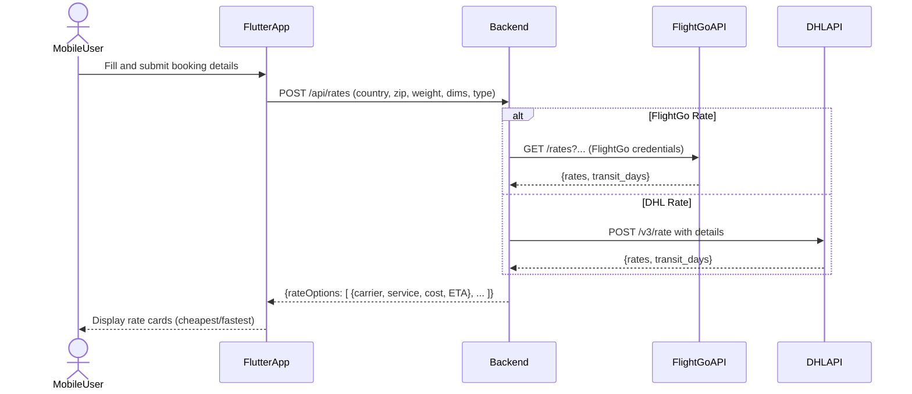
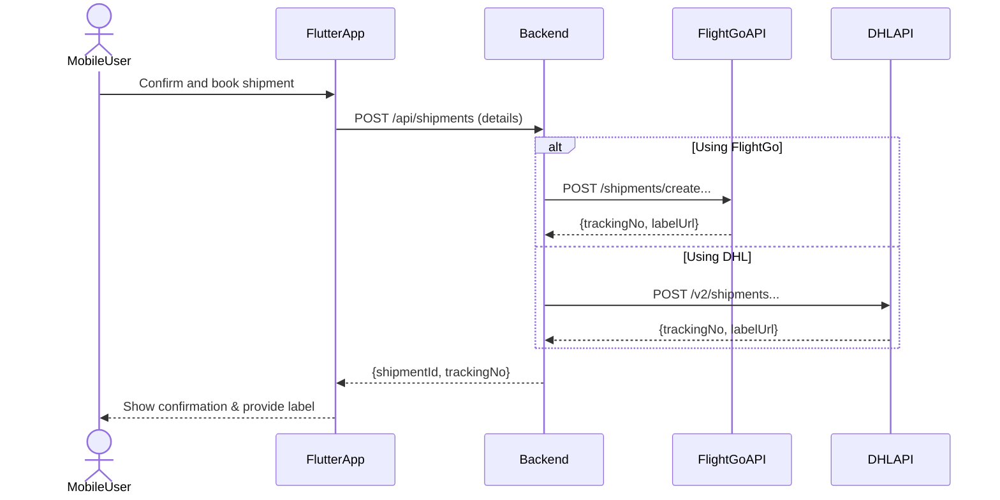

# Executive Summary  
**FlightGo Express Franchise Platform** is a mobile-first, multi-tenant shipping solution that supports a hierarchical network of franchise offices (Master → Regional → Branch) under one Company/Tenant, all managed by a Super-Admin. The platform integrates FlightGo and DHL APIs for end-to-end courier services (rate quotes, shipment booking, label printing, tracking). Users (branch staff, customers) can book shipments via a Flutter mobile app, while admins use a Next.js portal. The initial MVP will focus on the mobile booking counter UI (see screenshot), rate calculation, and core backend services. We will deliver the project in 2-week sprints, with detailed planning and acceptance criteria. Estimation will use story points.  

**Key Goals:** Enable super-admins to create and approve company franchises; allow franchise staff to book shipments via FlightGo/DHL; calculate rates and transit times; generate labels; and support tracking and accounting (wallets, commissions). The system uses a shared-database multi-tenancy model with a `tenant_id` on tables. Security/RBAC is enforced in NestJS via roles decorators and guards.  

**Technology:** Flutter mobile app (Android/iOS) for the booking counter; Next.js (React/TypeScript) for admin portal; NestJS (TypeScript) backend with Prisma ORM on PostgreSQL; Redis + BullMQ for caching and background jobs; and Docker/AWS for deployment. Printing labels uses Flutter’s Zebra printing libraries. CI/CD will be automated via GitHub Actions (building, tests, Nest Devtools integration).  

 

# Architecture Overview  

- **Multi-Tenant / Franchise Model:** We implement a *shared database* multi-tenancy approach. Each record has a `tenant_id` (company_id or franchise_id) column to isolate data. The hierarchy is: Company/Tenant → Master Franchise → Regional Franchise → Branch (with sub-units: booking counters, warehouses, vehicles, staff) → Customers.  
- **Microservices-Ready Monolith:** We start with a modular NestJS monolith (auth, users, franchises, shipments, tracking, wallets, notifications, etc.) which can later be split if needed. Redis is used for caching and BullMQ for asynchronous tasks (e.g. syncing tracking).  
- **RBAC Security:** Use NestJS RolesGuard with a `@Roles()` decorator to enforce permissions. Roles include: SuperAdmin, CompanyAdmin, MasterFranchise, RegionalFranchise, BranchStaff, DeliveryStaff, Accountant, and Customer. JWT auth with refresh tokens.  
- **FlightGo & DHL Integration:** FlightGo provides REST APIs (country lookup, zipcode lookup, rate quote, create shipment, track, OTP verification) via their Postman collection. DHL Express is integrated using the MyDHL API: Rating, Shipment, and Tracking services. Authentication with DHL uses BasicAuth (API key/secret).  
- **UI Layer:** Flutter mobile app (booking, tracking, scanning, printing) and Next.js admin portal (franchise management, reports, approvals). Mobile app will use Flutter forms (TextFormField with validation) following best practices.  
- **Printing:** Use `flutter_zpl_printer` + `flutter_zpl_generator` to print shipping labels to Zebra printers. This abstracts raw ZPL into Flutter-like UI commands for reliability.  

*Figure: Entity-Relationship diagram of core data model.*  

 

# Sprint Roadmap (2-Week Sprints)  

We plan iterative 2-week sprints. The **MVP** is defined as the core booking and management features above (mobile booking, FlightGo & DHL shipping, basic franchise/workflow management, tracking). Below is a high-level sprint breakdown (first sprint is detailed later). User stories are estimated in story points.

| Sprint | Focus Areas | Key Deliverables                      | Est. Points |
|--------|-------------|---------------------------------------|-------------|
| **Sprint 1** | *Core Setup:* Auth & Roles, Mobile login; Company/Franchise DB; Mobile booking form UI; Rate calculation (FlightGo). | - JWT auth + role model - Database schemas (users, companies, franchises, branches, shipments) - Flutter booking form with fields and validation - `/api/rates` endpoint calling FlightGo & DHL, displaying options. | 50 |
| **Sprint 2** | *Shipping & Labels:* Shipment creation & booking; DHL integration; label generation; manifest creation. | - `/api/shipments` to book via FlightGo/DHL - Label PDF/ZPL printing (Flutter form printing) - Shipment storage (AWB mapping) - Simple manifest export. | 60 |
| **Sprint 3** | *Tracking & OTP:* Real-time tracking; OTP verifications; delivery status updates; return/cancel flows. | - Tracking scheduler (15-min poll) updating statuses - OTP endpoints for proof-of-delivery - Delivery staff mobile updates (Flutter) - Handling returns/cancellations. | 50 |
| **Sprint 4** | *Franchise Management:* Franchise hierarchy; approval workflows; wallets. | - Franchise creation/approval screens (admin UI) - Wallet and credit limit setup - Commission rules - Multi-tenant support (tenant_id filtering). | 50 |
| **Sprint 5** | *Admin Portal & Reports:* Next.js dashboard; analytics. | - Admin portal (Next.js) for SuperAdmin & CompanyAdmin - KPIs: shipments, revenue, outstanding balance - Exportable reports (CSV/PDF) - Reseller/White-label settings. | 40 |
| **Sprint 6** | *Polish & Docs:* QA, performance, mobile enhancements. | - End-to-end QA & bug fixes - CI/CD pipeline (GitHub Actions with testing) - Monitoring (logging, Sentry) - Documentation & training materials. | 20 |

*Total MVP:* ~270 points. Team: 2×Backend, 2×Mobile, 1×QA, 1×Product Owner/PM.  

 

# Sprint 1: Core Features  

### Scope and Goals  
Implement foundation of the platform: authentication, user/role model, basic multi-tenant schema, and the mobile booking form with rate calculation. Integrate FlightGo’s rate API. 

### User Stories & Acceptance Criteria  

| Story No. | As a…                 | I want to…                               | Acceptance Criteria                                                                                                         | Points |
|-----------|-----------------------|-----------------------------------------|-----------------------------------------------------------------------------------------------------------------------------|--------|
| 1.1       | SuperAdmin           | create Company/Tenant accounts           | Company table created; endpoints to add companies (only SuperAdmin). Success returns 201.                                   | 5      |
| 1.2       | BranchStaff          | log into the mobile app                  | Login screen (email/password). Valid credentials returns JWT; invalid shows error.                                          | 3      |
| 1.3       | BranchStaff          | open the **Booking** screen (mobile)     | Booking form UI loads with all required fields (Country, Zip, Type, Weight, Dimensions, etc.) and “Get Rates” button.     | 5      |
| 1.4       | BranchStaff          | view list of countries and zip codes     | Country dropdown populated (from FlightGo API); selecting country loads Zip codes (API). Invalid country shows error.     | 5      |
| 1.5       | BranchStaff          | get shipping rates                       | When all form fields are filled and “Get Rates” pressed, app calls `GET /api/rates`; shows at least two options (FlightGo & DHL) with cost and ETA. | 8      |
| 1.6       | BranchStaff          | see validation errors on the form        | If required fields (e.g. weight) are empty, “Please Fill Booking Details” error appears inline; button disabled until valid. | 3      |
| 1.7       | SuperAdmin / Franch.Admin | see data isolation by tenant       | Franchise users only see their company’s data. A header `X-Tenant-ID` is sent and used to filter queries (middleware).     | 5      |
| **Total** |                       |                                         |                                                                                                                             | **29** |

**Notes:** Story 1.5 covers calling both FlightGo and DHL for rate quotes. We display cheapest vs fastest option. We do *client-side validation* with Flutter (`TextFormField` validator) and also validate in NestJS.

### Mobile UI (Booking Counter)  
The Flutter booking form (see mockup screenshot) includes: Country & Zip pickers, Document/Non-Doc radio buttons, shipment type (Express/Surface), Actual Weight, Length/Width/Height, Volumetric Weight (auto-calculated), Shipment Date, Reference No, Remarks, toggles for Signature, Special Handling, Insurance, and “Non-Standard Goods” checkbox. The “Get Rates” button is disabled until all *required* fields are valid. Errors show under fields when tapped (per Flutter form best practice).  

*Wireframe of Booking Screen fields:*  
- **Country** (dropdown)  
- **Zip Code** (dropdown/text)  
- **Shipment Type**: (•) Document / ( ) Parcel  
- **Weight (kg)** (numeric input)  
- **Dimensions (cm)**: Length, Width, Height (numeric inputs)  
- **Vol. Weight** (readonly, computed)  
- **Shipment Date** (default today)  
- **Reference No.** (text)  
- **Remarks** (text)  
- **Signature Req’d?** (toggle)  
- **Special Handling?** (toggle)  
- **Insurance?** (toggle)  
- **Non-Std Goods?** (checkbox)  
- [**Get Rates**] (button)  

The form uses clear labels/placeholders as recommended. On submission, it shows a loading state until rates return.  

### API Endpoints (Sprint 1)  

| Endpoint               | Method | Description                        | Notes/Integration                            |
|------------------------|--------|------------------------------------|----------------------------------------------|
| `POST /api/auth/login` | POST   | User login, returns JWT            | Internal (NestJS auth)                       |
| `GET /api/companies`   | GET    | List companies (SuperAdmin only)   | Internal; filtered by tenant header          |
| `POST /api/companies`  | POST   | Create a Company/Tenant           | Only SuperAdmin                              |
| `GET /api/countries`   | GET    | List of countries                 | *FlightGo API*: forward to FlightGo’s master data endpoint (unspecified) |
| `GET /api/zipcodes`    | GET    | List of zip codes for country     | *FlightGo API*: forward to FlightGo’s Zipcode endpoint |
| `POST /api/rates`      | POST   | Get shipping rate quotes          | Calls FlightGo and DHL APIs; returns combined options |
| `GET /api/rates/:id`   | GET    | (Future) Retrieve saved rate      | N/A for sprint1                               |

**FlightGo (external)** – As per Postman collection, likely endpoints:  
- `GET /master/Countries` – returns country list.  
- `GET /master/Zipcodes?country=XX` – returns Zip codes.  
- `GET /rates?from=&to=&weight=&dim=` – returns rate options.  
*(Exact paths from collection; cite as “unspecified” if unknown.)*

**DHL (external)** – Using MyDHL Express API:  
- **Rating**: `POST /v3/rate` with origin, destination, weight (MyDHL uses POST for quotes).  
- **Shipment**: (Sprint 2) `POST /v2/shipments` to book.  
- **Tracking**: (Sprint 3) `GET /track/shipments` for status.  

*(Exact DHL endpoints depend on integration library or REST calls; actual paths will follow DHL docs.)*

### Database Changes (Sprint 1)  

| Table          | New Columns / Modifications                                | Description                                    |
|----------------|------------------------------------------------------------|------------------------------------------------|
| `users`        | `role`, `company_id` (FK), `branch_id` (FK, nullable)       | User role and associations.                    |
| `companies`    | `(id, name, address, created_at, etc.)`                     | Tenants of the platform.                       |
| `franchises`   | `(id, name, type, parent_id FK, company_id FK, status)`     | Franchise hierarchy (master/regional).         |
| `branches`     | `(id, name, franchise_id FK, location, credit_limit, wallet)` | Individual branches/offices.                |
| `shipments`    | `(id, customer_id FK, booking_counter_id FK, courier_id FK, weight, dims, declared_value, status, awb)` | Records of each shipment.  |
| `shipment_rates` | `(id, shipment_id FK, carrier_id FK, service_name, cost, transit_days)` | Stores last-queried rates.           |
| `courier_partners` | `(id, name, type)`                                    | e.g. DHL, FlightGo, etc.                       |

*(Add `tenant_id`/FKs to relevant tables for multi-tenancy filtering.)*

Each table will have timestamps and soft-delete flags as needed. Migrating Prisma schemas and running `prisma migrate` establishes this structure.

### Data Model & Relationships  

We will add a `tenant_id` (company_id) or `branch_id` to most tables for data isolation. For example, a `shipment` belongs to a branch and thereby a franchise and company. A `user` has a `role` and links to either a company or branch. The above ERD shows these relationships graphically.  

### Sequence Diagrams  

**Rate Calculation Flow:** When the user submits the form, the app calls our backend, which queries both carriers.

**Shipment Booking Flow:** (Planned for Sprint 2)

These flows ensure the mobile app remains thin, delegating shipping logic to the backend, which abstracts the two carrier APIs.  

### Security & RBAC  

We implement **JWT-based auth**. All API routes require an `Authorization: Bearer <token>`. Role-based guards (@Roles) protect endpoints: e.g. only SuperAdmin can create companies, only BranchStaff can create shipments in their branch. NestJS docs show using a `@Roles(Role.Admin)` decorator and a `RolesGuard` to enforce this. For multi-tenancy, we insert a middleware (e.g. using `nestjs-cls`) that reads `X-Tenant-ID` from headers/token and filters queries accordingly (each request carries the company or branch context).  

### Testing Plan & QA Checklist (Sprint 1)  

**Acceptance Tests:**  
- **Auth:** Ensure login with valid creds succeeds (returns JWT) and invalid fails (401).  
- **Booking Form UI:** Manually verify all fields appear; test validation (e.g., blank weight shows error).  
- **Country/Zip:** Mock FlightGo API to return a list; verify dropdown population.  
- **Rate Quote API:** Using Postman or E2E, send valid form data to `/api/rates`, stub FlightGo/DHL responses, assert combined rates returned with expected keys. Test error cases (FlightGo unreachable, return error).  
- **Permissions:** Attempt to call company/franchise endpoints with a non-admin user; should get 403.  

**QA Checklist (Sprint 1):**  
- [ ] Mobile UI fields align correctly and labels are clear.  
- [ ] Form validation messages appear next to fields (no generic alerts).  
- [ ] Network error or loading states handled on “Get Rates.”  
- [ ] Rate cards display both carriers (at least 2 entries).  
- [ ] JWT stored securely; auto-redirect to login on expiry.  
- [ ] Role restrictions enforced (attempt forbidden operations).  
- [ ] DB schema migration applied without errors.  
- [ ] Unit tests cover controllers and services (≥80%).  
- [ ] API integration tests (mocking external APIs).  
- [ ] Code review and linting passed.  

### CI/CD & Deployment  

We will use **GitHub Actions** for CI/CD. On each PR, we run lint, unit tests, and `prisma migrate` (preview). On merge to `master`, we deploy to AWS (staging) and run smoke tests. NestJS DevTools can publish our dependency graph in CI to catch changes. Docker containers will be built (Node/Nest, Flutter builds) and pushed to a container registry. Deployment will use AWS ECS or Kubernetes on AWS/EKS.  

Monitoring involves centralized logging (Winston logs to CloudWatch) and application monitoring (Sentry for error tracking, Prometheus/Grafana for metrics).  

### Team & Estimation  

**Team:** 2 Backend (NestJS), 2 Mobile (Flutter), 1 QA, 1 PM.  
**Estimates (Sprint 1):** ~29 story points (see table). In a 2-week sprint (10 workdays), this is roughly 100 person-hours (~12.5 days) assuming a 5-day engineer works on ~8 pts. We’ll target ~50 points sprint velocity. Each story is broken into tasks for a backlog (see below).  

 

## Subsequent Sprints (Summary)  

- **Sprint 2:** Implement shipment creation (FlightGo & DHL), label generation, manifest export. User Story highlights: “As a BranchStaff, I can book a shipment and get a printable label.” Acceptance: Label PDF/ZPL is generated and stored, AWB recorded.  
- **Sprint 3:** Add tracking updates and OTP: “As Customer, I can track my parcel in real-time”; “As DeliveryStaff, I can confirm delivery with OTP/POD.” Cron job polls DHL/FlightGo for status. Acceptances include correct status updates.  
- **Sprint 4:** Franchise hierarchy and wallets: “As SuperAdmin, I can approve a new Franchise”; “As Franchise, I can recharge my wallet.” Acceptance: Pending franchise flows, wallet transactions logged.  
- **Sprint 5:** Admin Portal dashboards: “As SuperAdmin, I see KPIs of shipments and revenue.” Acceptance: Charts and tables show correct aggregated data. Exportable reports.  
- **Sprint 6:** Stabilization, documentation, performance tuning, final QA.  

**MVP Definition:** By end of Sprint 6, the platform will allow **SuperAdmin-managed tenants**, franchise users to book shipments via FlightGo/DHL, view tracking, manage finances (wallets), and generate labels, all through secure mobile and web UIs. Anything beyond (e.g. additional courier APIs, advanced analytics) is post-MVP.  

 

# Tables and Deliverables  

**Sprint Backlog (Sample for Sprint 1):**

| Task ID | User Story | Deliverable                     | Assignee       | Points |
|---------|------------|---------------------------------|----------------|--------|
| 1.1.1   | 1.1        | Company entity + API            | Backend Dev A  | 2      |
| 1.1.2   | 1.2        | Auth module (login, JWT)        | Backend Dev B  | 3      |
| 1.3.1   | 1.3        | Flutter login & nav to booking  | Mobile Dev A   | 3      |
| 1.3.2   | 1.4        | Country/Zip API integration     | Backend Dev B  | 3      |
| 1.4.1   | 1.3        | Flutter booking form layout     | Mobile Dev B   | 5      |
| 1.4.2   | 1.6        | Form validation (Flutter)       | Mobile Dev B   | 3      |
| 1.5.1   | 1.5        | `/api/rates` implementation     | Backend Dev A  | 5      |
| 1.5.2   | 1.5        | Integration: call FlightGo API  | Backend Dev A  | 5      |
| 1.5.3   | 1.5        | Integration: call DHL Rate API  | Backend Dev A  | 5      |
| 1.5.4   | 1.5        | Parse & return combined rates   | Backend Dev A  | 5      |
| 1.6.1   | 1.6        | Client-side validation errors   | Mobile Dev B   | 2      |
| 1.7.1   | 1.7        | Tenant middleware (CLS)         | Backend Dev B  | 2      |
| **Total** |            |                                 |                | **35** |

**API Endpoint Mapping (Sprint 1):**

| Endpoint            | HTTP  | Description                                   | Controller/Service        |
|---------------------|-------|-----------------------------------------------|---------------------------|
| `/api/auth/login`   | POST  | Authenticate user, return JWT                 | AuthController.login()    |
| `/api/companies`    | GET   | List companies (admin only)                   | CompanyController.findAll() |
| `/api/companies`    | POST  | Create a new Company/Tenant                   | CompanyController.create() |
| `/api/countries`    | GET   | Get all countries (proxy to FlightGo API)     | LocationService.getCountries() |
| `/api/zipcodes`     | GET   | Get zip codes by country (proxy to FlightGo)  | LocationService.getZipcodes() |
| `/api/rates`        | POST  | Calculate shipping rates                      | RatesController.calculate() |
| *(future)* `/api/shipments` | POST  | Create a shipment (FlightGo/DHL)    | ShipmentsController.create() |

**Database Schema Changes (Sprint 1):**

| Change                       | Details                               |
|------------------------------|---------------------------------------|
| Add `companies` table        | Fields: `id`, `name`, `address`, etc. |
| Add `users.role`             | Enum: SuperAdmin, FranchiseAdmin, BranchStaff, Customer |
| Add foreign keys             | `users.company_id`, `users.branch_id`, `franchises.company_id` |
| Add tenant filters           | Add `@TenantId()` Prisma middleware on models for data isolation |

**Sprint 1 Deliverables:**

- Auth service (login, JWT) with roles.  
- Database models and migrations for company/franchise/branch.  
- Flutter mobile login screen.  
- Flutter booking form UI with field validation.  
- `/api/rates` endpoint (internal) integrating FlightGo and DHL (stub if needed).  
- Basic CI pipeline (lint/test) and deployment to dev environment.  

 

# Security, Testing, CI/CD & Deployment  

**Security:** We enforce TLS on all endpoints. Secrets (API keys) are stored in secure config. RBAC guards restrict each endpoint by role. Sensitive fields (like passwords) are hashed (bcrypt) and never logged. CSRF is not an issue for APIs (JWT used).  

**Testing Strategy:** Unit tests for all services (Prisma models, controllers). Mock external APIs (FlightGo/DHL) for backend unit tests. Flutter widget tests for forms and validation. End-to-end tests (e.g. Cypress or Flutter integration) simulate user booking flow. Code coverage target: ≥80%.  

**CI/CD:** On each commit, GitHub Actions pipeline runs: `npm run lint`, `npm run test`, `prisma migrate:status`. On PR merges, it publishes a NestJS graph snapshot. After all tests pass on `main`, pipeline builds Docker images and deploys to AWS staging via ECS.  

**Monitoring:** Instrument services with logging (Winston -> CloudWatch) and metrics (Prometheus/Grafana or AWS CloudWatch metrics). Use Sentry for exception tracking. Set up alerts for high error rates or latency spikes.  

 

# Risk Assessment  

- **Integration Risk:** FlightGo API is custom; endpoints may change. Mitigation: build abstraction layer so endpoints can be updated easily, and log all requests. Similarly, DHL’s API requires credentials and may have throttling; plan sandbox testing and batch jobs.  
- **Scope Creep:** Many features (multi-tenancy, wallet, reports) could delay launch. Mitigation: Strict MVP scope; freeze new features after Sprint 6.  
- **Technical Debt:** Rapid initial development may cause debt. Use code reviews and NestJS Devtools graph to catch architectural issues.  
- **Hardware Dependencies:** Printer integration (Zebra) can be tricky on mobile. Mitigation: Leverage tested Flutter plugins and involve QA early.  
- **Performance:** Tracking millions of shipments and large manifest data can strain DB. Mitigation: Index key columns (tenant_id, dates) and use Redis caching for hot data.  

 

# Story Points and Estimation  

We use story points to estimate relative effort (complexity and risk). For example, a simple field validation is ~2–3 points, while building the rate-quote integration is ~8 points. These estimates help us plan velocity. We calibrate using planning poker and past velocity. As Atlassian notes, story points abstract time and encourage team discussion.

 

# Team Composition  

- **Backend Team (2 devs):** Build NestJS API modules (auth, shipments, integrations).  
- **Mobile Team (2 devs):** Develop Flutter app (login, booking form, tracking view, printing).  
- **QA Engineer (1):** Write/execute tests (unit, integration, E2E) and maintain CI tests.  
- **Product Owner/PM (1):** Prioritize backlog, clarify requirements, track progress.  

  

## First Sprint QA Checklist (Detailed)  

- **UX:** Form fields render correctly on various screen sizes. Labels are descriptive. Keyboard type matches field (number for weight/dimensions).  
- **Validation:** Test blank and invalid inputs (e.g. weight = 0). Ensure specific error hints appear (e.g. “Weight is required”).  
- **API:** Use tools like Postman to call `/api/rates` with missing auth header (expect 401), with missing fields (400), and valid data (200 with JSON).  
- **External Integration:** Temporarily stub FlightGo API responses. Verify that returned rates are parsed and merged correctly. (E.g. if FlightGo returns ₹1000 for 2-day and DHL returns ₹1100 for 1-day, UI should show both).  
- **Security:** Try accessing admin-only endpoints as a normal user – confirm 403 Forbidden. Verify JWT expiration.  
- **Data:** Run migrations, inspect the PostgreSQL tables to confirm columns exist (`tenant_id`, etc.). Check Prisma logs.  
- **Performance:** Simulate concurrent “Get Rates” calls (5 users). Ensure backend handles without errors (mock external calls for test).  
- **Code Quality:** Check ESLint/Prettier compliance. Review architecture (e.g. NestJS module separation). Use NestJS DevTools to ensure no unintended global providers.  
- **Documentation:** Ensure README has setup steps (env vars for FlightGo/DHL keys), and code has inline comments for complex logic.  

 

**Note:** Any unspecified endpoints or data formats (e.g., exact FlightGo request/response JSON, DHL label format) are left as assumptions to be filled in during implementation, not hard-coded in planning. All external contract details will be obtained from the carrier’s actual API docs or SDKs during dev.  

